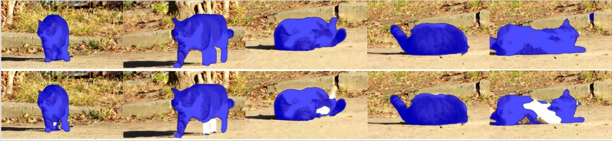

# Efficient Long-Short Temporal Attention Network for Unsupervised Video Object Segmentation

## Introduction

Unsupervised Video Object Segmentation (VOS) aims at identifying the contours of primary foreground objects in videos without any prior knowledge. However, previous methods do not fully use spatial–temporal context and fail to tackle this challenging task in real-time. This motivates us to develop an efficient Long-Short Temporal Attention network (termed LSTA) for unsupervised VOS task from a holistic view. Specifically, LSTA consists of two dominant modules, i.e., Long Temporal Memory and Short Temporal Attention. The former captures the long-term global pixel relations of the past frames and the current frame, which models constantly present objects by encoding appearance pattern. Meanwhile, the latter reveals the short-term local pixel relations of one nearby frame and the current frame, which models moving objects by encoding motion pattern. To speedup the inference, the efficient projection and the locality-based sliding window are adopted to achieve nearly linear time complexity for the two light modules, respectively.


<p align="center">

</p>

## Installation

1. Environment:

   - Python 3.8
   - PyTorch 1.8
   - CUDA 11.1
   - OpenCV 4.5.2
```
conda create -n LSTA python=3.8 & y
conda activate LSTA
conda install pytorch==1.8.0 torchvision==0.9.0 torchaudio==0.8.0 cudatoolkit=11.1 -c pytorch -c conda-forge
pip install opencv-python
```

2. Dataset preparation:
   - DAVIS2017: put under `data/DAVIS/`.
   - YouTube-VOS2019: put under `data/YTB/`.
   

After downloading the datasets, use the commands below to generate soft links.
```
ln -s /path/to/DAVIS/* data/DAVIS/
ln -s /path/to/YouTube-VOS/2019/* data/YTB/
```

After running the above commands, the data file should be like:

```
data/
├── DAVIS
│   ├── Annotations -> /data16t/data/DAVIS/DAVIS/Annotations
│   ├── ImageSets -> /data16t/data/DAVIS/DAVIS/ImageSets
│   ├── JPEGImages -> /data16t/data/DAVIS/DAVIS/JPEGImages
│   ├── README.md -> /data16t/data/DAVIS/DAVIS/README.md
│   ├── readme.txt
│   └── SOURCES.md -> /data16t/data/DAVIS/DAVIS/SOURCES.md
└── YTB
    ├── readme.txt
    ├── train -> /data16t/data/YTB/2019/train
    ├── train.zip -> /data16t/data/YTB/2019/train.zip
    ├── valid -> /data16t/data/YTB/2019/valid
    └── valid.zip -> /data16t/data/YTB/2019/valid.zip
```
## Training
Put the following weights under the `pretrained` folder.
- STM weight from this [url](https://github.com/seoungwugoh/STM).
- resnet101-deeplabv3p.pth from this  [url](https://pytorch.org/hub/pytorch_vision_deeplabv3_resnet101/). 

All the configurations are in `config.py`. In order to train on DAVIS and YouTube-VOS, please change the `self.DATASETS = ['youtubevos', 'davis2017']` to `self.DATASETS = [ 'davis2017']` in first step training with `self.TRAIN_TOTAL_STEPS = 50000`.
Then use the following command to start training. 
```
bash train.sh
```
In order to train on DAVIS and YouTube-VOS, one should set  `self.DATASETS = ['youtubevos', 'davis2017']`  and  `self.TRAIN_TOTAL_STEPS = 25000`.
Then use the `bash train.sh` command to start training. Please iteratively train the model until the satisfying score is achieved.

## Testing

Download and put the model weights under the current dir. Run the following command, the segmentation results on DAVIS2016 val set will be generated under the `log` dir.

```
bash eval.sh
```

## Quantitative results on DAVIS2016.

|       |  J   |  F   | average | TITAN XP | 2080TI  |
|:-----:|:----:|:----:|:-------:|----------|---------|
| LSTA  | 82.4 | 84.3 |  83.4   | 42.8fps  | 62.3fps |

## Qualitative results 


<p align="center">
     <br>
</p>

Segmentation results of LSTA (Row 1) and MATNet (Row 2) on one randomly selected video from YouTube-objects.

## Citation

If you find this repo useful, please cite the following paper.
```
@article{li-lsta-pr2024,
  author    = {Ping Li, Yu Zhang, Li Yuan, Huaxin Xiao, Binbin Lin, Xianghua Xu},
  title     = {Efficient Long-Short Temporal Attention Network for Unsupervised Video Object Segmentation},
  journal   = {Pattern Recognition (PR)},
  volume    = {146},
  pages     = {110078}
  year      = {2024},  
  doi       = {https://doi.org/10.1016/j.patcog.2023.110078}
}
```
## Contact
If you have any questions, please contact Mr. Zhang Yu via email at zycs@hdu.edu.cn.

## Acknowledgement

We would like to thank the authors of [CFBI](https://github.com/z-x-yang/CFBI) and [anchor-diff-VOS](https://github.com/yz93/anchor-diff-VOS), which significantly accelerated the development of our LSTA model. 

